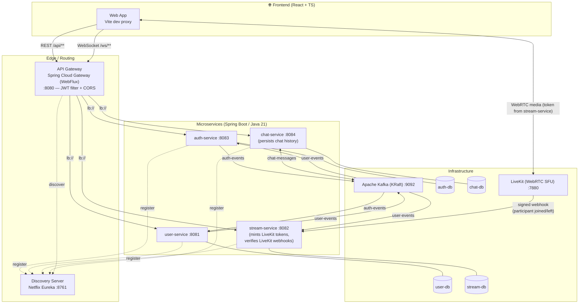

# IRL Streaming Platform — Backend

> A Twitch-style **live streaming platform** built on an **event-driven microservices architecture**.
> Real-time video (WebRTC), real-time chat with persisted history (WebSocket + Kafka), backend-issued
> media credentials, stateless JWT security, and a fully containerized stack.

**This repository contains the BACKEND** (microservices, messaging, databases and infrastructure).
👉 **Frontend (React + TypeScript) lives here:** [`irl-streaming-front`](../irl-streaming-front) · _replace with your GitHub URL, e.g._ `https://github.com/<user>/irl-streaming-front`

---

## 📌 Table of Contents
- [Overview](#-overview)
- [Architecture](#-architecture)
- [Tech Stack](#-tech-stack)
- [Microservices](#-microservices)
- [Event-Driven Communication (Kafka)](#-event-driven-communication-kafka)
- [Security](#-security)
- [Media (LiveKit)](#-media-livekit)
- [Data Layer](#-data-layer)
- [Testing](#-testing)
- [Getting Started](#-getting-started)
- [API Reference](#-api-reference)
- [Design Decisions & Trade-offs](#-design-decisions--trade-offs)
- [Roadmap](#-roadmap)

---

## 🎯 Overview

This project reproduces the core of a live streaming platform (à la Twitch): users register, create a channel/stream, go **LIVE** broadcasting their camera and microphone over **WebRTC**, and viewers watch in real time while participating in a **live chat** that keeps its history.

Rather than a monolith, it is deliberately built as a **distributed system** to practice the patterns real streaming platforms rely on: independent deployability, asynchronous decoupling through an event bus, per-service data ownership, centralized authentication and horizontal scalability of the most demanding services (video and chat).

**Highlights**
- 🧩 **6 independent microservices** coordinated by an API Gateway + Service Discovery.
- 📨 **Asynchronous, event-driven communication** via Apache Kafka, with **idempotent consumers** (safe against at-least-once redelivery).
- 🔐 **Stateless JWT authentication** enforced centrally at the gateway.
- 🎥 **Real-time video** through WebRTC (LiveKit SFU) — **access tokens are minted entirely server-side**; the media secret never reaches the browser.
- 📊 **Live, accurate viewer counts**, driven by signature-verified LiveKit webhooks.
- 💬 **Real-time chat with persisted history**, fanned out through Kafka.
- 🐘 **Database-per-service** (4 databases) with PostgreSQL and Flyway-versioned schemas.
- ✅ **Unit-tested service layer** (JUnit 5 + Mockito) that runs fully offline (H2), no external infra required.
- 🐳 **One-command startup** — the entire stack (12 containers) runs with Docker Compose.

---

## 🏗 Architecture



**Request lifecycle (example — going live):**
1. Client calls `POST /api/streams/{id}/token` through the **API Gateway** (JWT required).
2. `stream-service` checks the caller against the stream's owner and mints a **scoped LiveKit access
   token** — `canPublish: true` only if they own the stream. The LiveKit secret never leaves this service.
3. The client connects directly to **LiveKit** with that token to publish/subscribe media.
4. As viewers join/leave, LiveKit calls back `stream-service`'s **signed webhook** to keep `viewerCount` accurate.

---

## 🧰 Tech Stack

| Layer | Technologies |
|---|---|
| **Language / Runtime** | Java 21 |
| **Framework** | Spring Boot 4, Spring Web, Spring WebFlux, Spring Data JPA, Spring WebSocket, Spring Security Crypto |
| **Microservices** | Spring Cloud Gateway (reactive), Netflix Eureka (service discovery) |
| **Messaging** | Apache Kafka (KRaft mode — no ZooKeeper) |
| **Database** | PostgreSQL 17, Flyway (schema migrations), Hibernate |
| **Real-time media** | LiveKit (WebRTC SFU) — server-side token issuance + webhook verification |
| **Real-time chat** | WebSocket + STOMP, persisted to PostgreSQL |
| **Security** | JWT (JJWT, HS256), BCrypt password hashing, role-based authorization |
| **Testing** | JUnit 5, Mockito, AssertJ, H2 (in-memory, offline test profile) |
| **Build & Infra** | Maven, Docker, Docker Compose |
| **Tooling** | Kafka UI, Postman collection |

---

## 🧩 Microservices

| Service | Port | Responsibility | Data / Messaging |
|---|---|---|---|
| **discovery-server** | 8761 | Service registry (Eureka) — every service registers and is discovered by logical name | — |
| **api-gateway** | 8080 | Single entry point. Routing, **global JWT validation**, CORS, header propagation | Reactive (WebFlux) |
| **auth-service** | 8083 | Registration, login, password hashing (BCrypt), **JWT issuing** | `auth-db` · produces `auth-events`, consumes `user-events` |
| **user-service** | 8081 | User profiles & lifecycle. Created **reactively** from auth events | `user-db` · consumes `auth-events`, produces `user-events` |
| **stream-service** | 8082 | Streams CRUD, **LiveKit token issuance**, **webhook-driven viewer count**, `LIVE/OFFLINE` status | `stream-db` · consumes `user-events` |
| **chat-service** | 8084 | Real-time chat via WebSocket/STOMP; **persists history**; Kafka-backed fan-out | `chat-db` · consumes/produces `chat-messages` |

Each service follows a clean, layered structure: **Controller → Service → Repository**, with **DTOs**, **Mappers**, dedicated **enums/entities**, and a **global exception handler** returning consistent error responses.

---

## 📨 Event-Driven Communication (Kafka)

Services **never call each other directly to mutate state** — they publish domain events and react to them. This keeps services decoupled and resilient: if a consumer is temporarily down, events are processed once it recovers.

| Topic | Producer | Consumer(s) | Event | Purpose |
|---|---|---|---|---|
| `auth-events` | auth-service | user-service | `UserCreatedEvent` | Provision a user profile after registration |
| `user-events` | user-service | auth-service, stream-service | `UserDeletedEvent` | Cascade account deletion (remove credentials + user's streams) |
| `chat-messages` | chat-service | chat-service | `ChatMessage` | Persist + fan-out chat messages to all subscribers/instances |

> **Why fan-out chat through Kafka?** It decouples message ingestion from delivery and lets the chat service scale to multiple instances while every WebSocket subscriber of a stream still receives every message.

**Idempotent consumers:** Kafka guarantees *at-least-once* delivery, so every `@KafkaListener` is written
to be a safe no-op on redelivery (`existsById` guards in `user-service.createUser` and
`auth-service.deleteUser`) instead of throwing on a duplicate.

---

## 🔐 Security

- **Stateless JWT** (HS256) issued by `auth-service` on login; tokens carry `sub` (user id), `username` and `role`, and expire in 3 hours.
- **Centralized enforcement at the gateway** — a single global `JwtAuthFilter` validates every request. Downstream services trust the `user_id` / `user_role` headers the gateway injects, so they don't re-implement auth.
- **Public routes** are explicitly whitelisted: `POST /api/auth/register`, `POST /api/auth/login`, and `GET /api/streams/**` (public catalog).
- **Passwords** are hashed with **BCrypt** (`spring-security-crypto`) — never stored in plaintext.
- **Role-based authorization** (`USER` / `ADMIN`) — e.g. only the owner (or an admin) can delete an account or change a stream's status.
- **Media credentials are never trusted from the client** — see [Media (LiveKit)](#-media-livekit) below.

---

## 🎥 Media (LiveKit)

LiveKit access tokens (the credentials a browser needs to publish/subscribe WebRTC media) are minted
**exclusively by `stream-service`** — the LiveKit API secret lives only in the backend's config/env.

- `POST /api/streams/{id}/token` (authenticated): looks up the stream, compares the requester's
  `user_id` against the stream owner, and returns a JWT-based LiveKit token with `canPublish` set
  accordingly. A viewer can never obtain publish rights, no matter what the client sends.
- `POST /api/streams/webhook/livekit` (server-to-server, called directly by the LiveKit container over
  the Docker network — **not** routed through the gateway): LiveKit posts `participant_joined` /
  `participant_left` / `room_finished` events here. Every call is **signature-verified** — the
  `Authorization` header's JWT issuer and its `sha256` body-hash claim are checked against the same
  API key/secret pair before the payload is trusted — and used to keep `Stream.viewerCount` accurate.

---

## 🗄 Data Layer

**Database-per-service** pattern — each service owns and isolates its schema; no cross-service database access.

| Database | Owner | Port | Key tables |
|---|---|---|---|
| `authdb` | auth-service | 5434 | `auth_user` (credentials, role) |
| `userdb` | user-service | 5432 | `users` (public profile) |
| `streamdb` | stream-service | 5433 | `stream` (title, category, status, stream_key, viewer_count) |
| `chatdb` | chat-service | 5435 | `chat_message` (stream_id, user_id, username, content, created_at) |

Schemas are versioned and applied automatically with **Flyway** (`src/main/resources/db/migration`). Hibernate runs in `ddl-auto=validate`, so the code never silently mutates the schema — migrations are the single source of truth.

---

## ✅ Testing

- **Unit tests** (JUnit 5 + Mockito + AssertJ) cover the service layer of `auth-service`, `user-service`
  and `stream-service` — registration/login rules, ownership checks, idempotent event handling,
  and LiveKit token scoping (owner vs. viewer).
- Every service also ships an **H2-backed test profile** (`src/test/resources/application.properties`,
  with Flyway/Eureka disabled), so `./mvnw test` — including the generated `contextLoads` smoke test —
  runs **standalone, with zero external infrastructure**.

```bash
cd stream-service && ./mvnw test   # or auth-service / user-service / chat-service
```

---

## 🚀 Getting Started

### Prerequisites
- Docker & Docker Compose
- (For local, non-Docker runs) JDK 21 & Maven

### 1. Configure environment
Copy the example env file and adjust as needed:

```bash
cp .env.example .env
```

```env
JWT_SECRET=change-me-with-a-long-random-secret-at-least-32-chars
DB_PASSWORD=123
LIVEKIT_API_KEY=devkey
LIVEKIT_API_SECRET=devsecret
LIVEKIT_WS_URL=ws://localhost:7880
```

> `LIVEKIT_API_KEY`/`LIVEKIT_API_SECRET` must match the `keys:`/`webhook.api_key` entries in `livekit.yaml`.

### 2. Run the whole stack
```bash
docker compose up --build
```

This starts **12 containers**: 4× PostgreSQL, Kafka + Kafka UI, LiveKit, the discovery server, the API gateway and the 4 business services.

### 3. Useful endpoints
| Service | URL |
|---|---|
| API Gateway | http://localhost:8080 |
| Eureka Dashboard | http://localhost:8761 |
| Kafka UI | http://localhost:8090 |
| LiveKit | ws://localhost:7880 |

> A **Postman collection** is included in [`/postman`](./postman) to exercise the API end-to-end.

---

## 📡 API Reference

All requests go through the gateway (`http://localhost:8080`). Protected routes require `Authorization: Bearer <token>`.

### Auth — `auth-service`
| Method | Endpoint | Auth | Description |
|---|---|---|---|
| `POST` | `/api/auth/register` | Public | Register a new account |
| `POST` | `/api/auth/login` | Public | Authenticate, returns a JWT |

### Users — `user-service`
| Method | Endpoint | Auth | Description |
|---|---|---|---|
| `GET` | `/api/users` | JWT | List users |
| `GET` | `/api/users/{id}` | JWT | Get a user |
| `DELETE` | `/api/users/{id}` | JWT (owner/admin) | Delete account (cascades via `user-events`) |

### Streams & media — `stream-service`
| Method | Endpoint | Auth | Description |
|---|---|---|---|
| `GET` | `/api/streams` | Public | Public catalog of streams |
| `GET` | `/api/streams/{id}` | Public | Stream detail |
| `GET` | `/api/streams/user/{userId}` | Public | Stream by user |
| `POST` | `/api/streams` | JWT | Create a stream (title, description, category) |
| `PATCH` | `/api/streams/{id}/status` | JWT (owner) | Toggle `LIVE` / `OFFLINE` |
| `POST` | `/api/streams/{id}/token` | JWT | Get a scoped LiveKit access token (publish rights only for the owner) |
| `POST` | `/api/streams/webhook/livekit` | Signed webhook (not user-facing) | LiveKit → viewer-count updates |

### Chat — `chat-service`
| Method / Channel | Destination | Description |
|---|---|---|
| `GET` | `/api/chat/{streamId}/history` | Last 50 messages, oldest first |
| STOMP endpoint | `/ws/chat` | WebSocket handshake |
| Publish | `/app/chat/{streamId}` | Send a message |
| Subscribe | `/topic/stream/{streamId}` | Receive live messages |

---

## 🧠 Design Decisions & Trade-offs

- **Microservices over a monolith** — chosen to isolate the workloads with very different scaling profiles (video signaling and chat vs. CRUD). The trade-off is higher operational complexity, addressed with Docker Compose + Eureka + a gateway.
- **Kafka over synchronous REST for state propagation** — favors decoupling and resilience (eventual consistency) at the cost of not having strong immediate consistency across services. Consumers are made idempotent to tolerate Kafka's at-least-once delivery.
- **JWT validated once, at the gateway** — avoids duplicating security logic in every service and keeps downstream services simple and stateless.
- **Database-per-service** — enforces bounded contexts and independent deployability; the price is coordinating changes through events instead of foreign keys.
- **LiveKit (SFU) for media, tokens minted server-side** — an SFU scales to many viewers far better than a mesh/P2P topology; keeping the signing secret server-side is the difference between "anyone can broadcast to any room" and a properly scoped system.
- **Webhook-verified viewer counts** over a naive client-reported counter — a client can lie about how many people are watching; a signed server-to-server callback can't be spoofed the same way.

---

## 🗺 Roadmap

Honest view of what's next (this project is actively evolving):

- [ ] **Integration tests with Testcontainers** (Postgres + Kafka) to validate the event flows end-to-end, complementing the existing mocked unit tests.
- [ ] **Rate-limit** chat and stream creation.
- [ ] **Dead-letter topics + retry policy** for Kafka consumers.
- [ ] **Observability** — structured logging, metrics (Micrometer/Prometheus) and distributed tracing.
- [ ] **CI/CD pipeline** and Kubernetes manifests for cloud deployment.
- [ ] Chat moderation, follows/subscriptions between users.

---

## 👤 Author

Built by **Thomas Brück** as an in-depth exploration of distributed systems, event-driven design and real-time media.

- 🔗 **Frontend repository:** [`irl-streaming-front`](../irl-streaming-front)
- 💼 Open to backend / full-stack software engineering opportunities.
